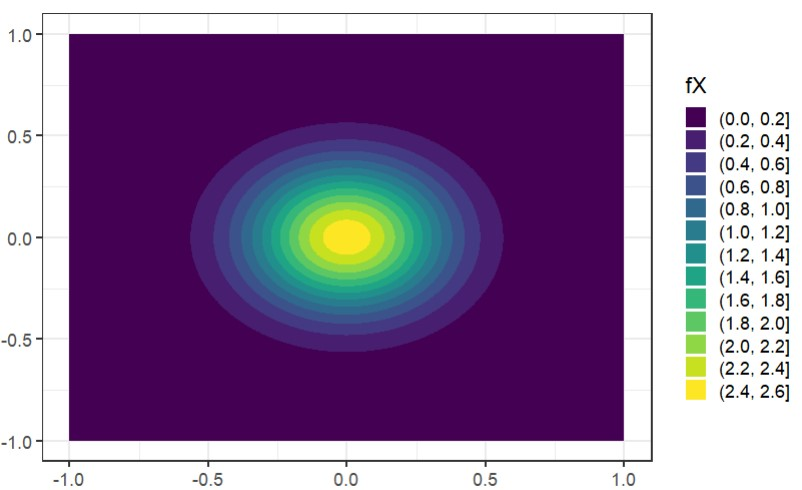
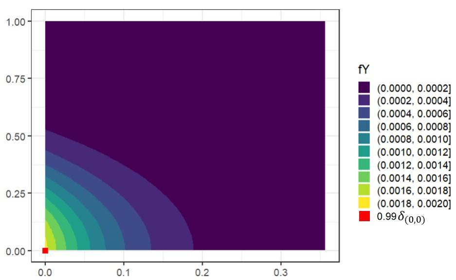
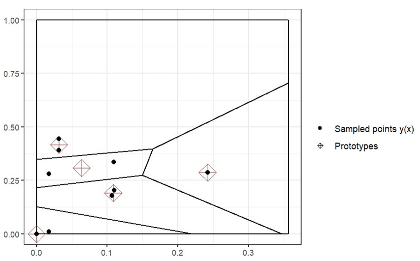
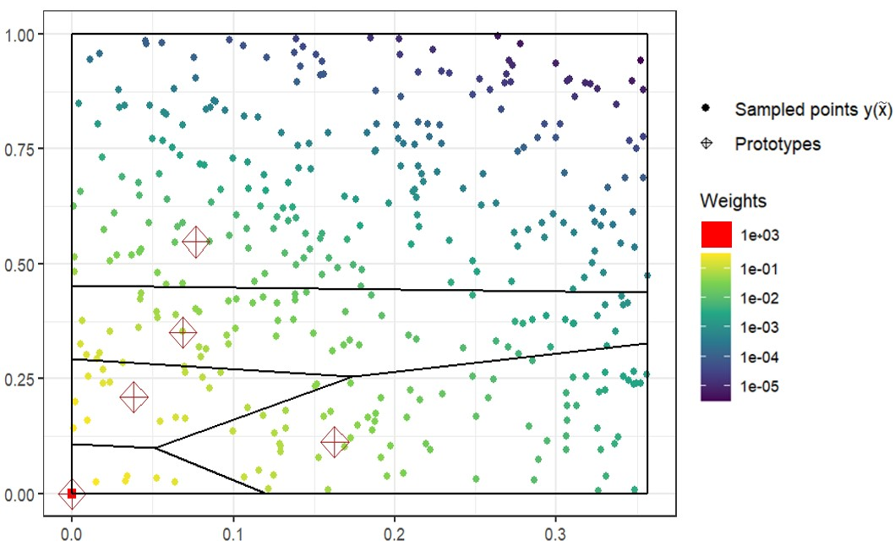

# Summary

Quantization summarises continuous distributions by providing a discrete approximation [@Pages]. Among the widely adopted methods for data quantization is the Lloyd's algorithm, which partitions the space into Voronoï cells, that can be seen as clusters, and constructs a discrete distribution based on their centroids and probabilistic masses. Lloyd's algorithm investigates the optimal centroids in a minimal expected distance sense [@Bock], but this approach poses significant challenges in scenarios where data evaluation is costly, and relates to a rare event that accumulates the majority of the probabilistic mass in a single cluster. In this context, a metamodel is required [@Friedman] and adapted sampling methods are relevant to increase the precision of the computations on the rare clusters.

# Statement of need

FunQuant is a R package that has been specifically developed for carrying out quantization in the context of rare events. While numerous cutting-edge packages facilitate straightforward implementation of the Lloyd's algorithm, they lack the incorporation of any probabilistic factors, treating all data points equally in terms of weighting. Conversely,  FunQuant considers probabilistic weights based on the Importance Sampling formulation [@Paananen] to handle the problem of rare event. To be more precise, when $X$ and $Y$ are the random input and the output of a computer code respectively,  the quantization of $Y(X)$ is performed by estimating the centroid of a given cluster $C$ with the following formula: 

$$\frac{\frac{1}{n} \sum^{n}_{k=1} Y(\tilde{X}_{k})\mathbb{1}_{Y(\tilde{X}_{k})\in C}\frac{f_{X}(\tilde{X}_k)}{g(\tilde{X}_{k})}}{\frac{1}{n} \sum^{n}_{k=1} \mathbb{1}_{Y(\tilde{X}_k)\in C} \frac{f_{X}(\tilde{X}_k)}{g(\tilde{X}_{k})}}$$
where $f_{X}$ is the known density function of the inputs $X$, and $(\tilde{X}_k)^{n}_{k=1}$ i.i.d. random variables of density function $g$.
Importance Sampling is employed with the aim of reducing the variance of the estimators of the centroids when compared to classical Monte Carlo methods. FunQuant provides various approaches for implementing these estimators, depending on the sampling density denoted as $g$. The simplest method involves using the same function $g$ for each iteration and every cluster, which is straightforward to work with and still yields significant variance reduction. More advanced implementations enable the adaptation of the sampling density for each cluster at every iteration.

In addition, FunQuant is designed to mitigate the computational burden associated with the evaluation of costly data. While users have the flexibility to use their own metamodels to generate additional data, FunQuant offers several functions tailored specifically for a metamodel dedicated to spatial outputs such as maps. This metamodel relies on Functional Principal Component Analysis and Gaussian Processes, based on the work of [@Perrin], adapted with the rlibkriging R package [@rlib]. FunQuant assists in the fine-tuning of its hyperparameters for a quantization task, with different performance metrics involved.

Additional theoretical information can be found in [@sire]. The paper provides a comprehensive exploration of the application of FunQuant to the quantization of flooding maps.

# Illustrative example

We consider $X = (X_{1},X_{2}) \in \mathbb{R}^2$ a random input of a computer code $H$, with
$$\left\{
    \begin{array}{ll}
        X_{i} \sim \mathcal{N}_{t}(0,0.25^2, -1, 1), i=1,2 \\
        X_{1} \text{ and }X_{2}\text{ independent}
    \end{array}
\right.$$

where $\mathcal{N}_{t}(\mu,\sigma^2, a, b)$ is the Gaussian distribution of mean $\mu$, variance $\sigma^2$, truncated between $a$ and $b$. 

The density function of $X$, denoted $f_{X}$, is represented in \autoref{fx}.

{ width="1100" style="display: block; margin: 0 auto" }

The computer code $H$ is defined with 
$$H(x) = \left\{
    \begin{array}{ll}
        (0,0) \text{ if } \lvert x_{1}\rvert \leq \alpha \\
        (\lvert x_{1} \rvert - \alpha, \lvert x_{2} \rvert) \text{ else.}
    \end{array}
\right.$$

with $\alpha$ such that $P(G(X) = (0,0)) = 0.99.$.

The density $f_{Y}$ of the output $Y = H(X)$ is represented in \autoref{fy}.
{ width="1100" style="display: block; margin: 0 auto" }

$99\%$ of the probability mass is concentrated at $(0,0)$.

We want to perform quantization on $Y(X)$.

 If the classical Lloyd's algorithm is performed with a budget of $1000$ points, it leads to the outcome illustrated in \autoref{kmeans_quanti}, with only a few sampled points not equal to $(0,0)$. Then, the centroids of the Voronoi cells that do not contain $(0,0)$ are computed with a very small number of points, leading to a very high variance.

{ width="1100" style="display: block; margin: 0 auto" }


The FunQuant package allows to adapt the sampling by introducing a random variable $\tilde{X}$ of density $g$, and considering the probabilistic weights of each sample, with are the ratio $\frac{f_{X}}{g}$.

A possible function $g$ is $g(x) = \frac{1}{4}\mathbb{1}_{[-1,1]^2}(x)$, corresponding to a uniform distribution in $[-1,1]^2$.

```r
fX = function(x){
  return(
    dtruncnorm(x = x[1],mean = 0,sd = sd1,a=-1, b=1)*dtruncnorm(x = x[2],mean = 0,sd = sd2,a=-1, b=1))
}

g = function(x){return(1/4)}

sample_g = function(n){cbind(runif(n,-1,1), runif(n,-1,1))
}

inputs = sample_g(1000)
outputs = t(apply(inputs,1,Y))
density_ratio = compute_density_ratio(f = fX, 
                                      g = g, 
                                      inputs = inputs)
                                    
res_proto = find_prototypes(data = t(outputs),
                            nb_cells = 5,
                            multistart = 3,
                            density_ratio = density_ratio)
```

\autoref{is_quanti} shows the sampled points $Y(\tilde{X}_{k})$, their associated probabilistic weights, and the obtained prototypes. It clearly appears that this sampling brings more information about each Voronoi cells. 

{ width="1100" style="display: block; margin: 0 auto" }


FunQuant allows to estimate the standard deviations of the two coordinates of the estimators of the centroids for each Voronoi cell, highlighting the variance reduction obtained with the adapted sampling for the cells that do not contain $(0,0)$.


```r
large_inputs = sample_fX(10^5)
large_outputs = apply(large_inputs,1, Y)
std_centroid_kmeans = std_centroid(
              data = large_outputs, 
              prototypes_list = list(protos_kmeans),
              cells = 1:5, 
              nv = 1000)

std_centroid_kmeans #the cells are ordered by the increasing coordinate x
#of their centroid

# std centroid returns a list of lists: for each tested set of prototypes (here only one set is tested), a list of the estimated standard deviations is provided, each element of this list is associated to a Voronoï cell
```

    ## [[1]]
    ## [[1]][[1]]
    ## [1] 0.0001193543 0.0001012730
    ## 
    ## [[1]][[2]]
    ## [1] 0.04884616 0.07905258
    ## 
    ## [[1]][[3]]
    ## [1] 0.03006552 0.02934998
    ## 
    ## [[1]][[4]]
    ## [1] 0.03214239 0.02801202
    ## 
    ## [[1]][[5]]
    ## [1] 0.06158175 0.12912278


```r

large_inputs_is = sample_g(10^5)
large_outputs_is = apply(large_inputs_is,1, Y)
std_centroid_funquant = std_centroid(
              data = large_outputs_is, 
              prototypes_list = list(protos_funquant),
              cells = 1:5, 
              nv = 1000)

std_centroid_funquant #the cells are ordered by the increasing coordinate x 
#of their centroid

```

    ## [[1]]
    ## [[1]][[1]]
    ## [1] 0.0002358303 0.0002390596
    ## 
    ## [[1]][[2]]
    ## [1] 0.00901367 0.01033904
    ## 
    ## [[1]][[3]]
    ## [1] 0.012857642 0.006439004
    ## 
    ## [[1]][[4]]
    ## [1] 0.00726317 0.01139948
    ## 
    ## [[1]][[5]]
    ## [1] 0.009168924 0.009620646


This example remains basic. Advanced computations of the centroids with tailored density functions $g$ can be performed. FunQuant was built to tackle industrial problems with large amounts of data, with possibilities to split the computations into different batches for instance. 

# Acknowledgments

This research was conducted with the support of the consortium in
Applied Mathematics CIROQUO, gathering partners in technological and
academia in the development of advanced methods for Computer
Experiments.

# References
